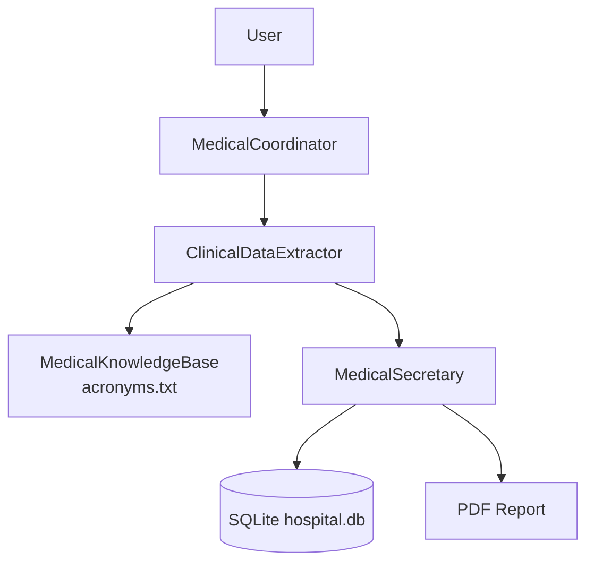

# 08-medical-rag-system

RAG-based multi-agent medical documentation system that standardizes terminology using a local knowledge base before persisting records.

## Overview

Project 08 introduces a **keyword-based RAG step** in the `ClinicalDataExtractor` agent:

- `ClinicalDataExtractor` must call `SearchMedicalKnowledge` for medical history terms.
- `MedicalSecretary` persists data to SQLite and generates PDF reports.
- `MedicalCoordinator` orchestrates specialist execution.

This reduces acronym hallucination and keeps records consistent with hospital conventions.

## Architecture



## Prerequisites

- .NET 10 SDK
- LM Studio running at `http://localhost:1234/v1`
- A chat model loaded in LM Studio (default in code: `qwen2.5-7b-instruct`)

## Run

```bash
cd agents-examples/08-medical-rag-system
dotnet run
```

On first run the app will:

1. Initialize `hospital.db`
2. Seed `MedicalDocuments/acronyms.txt` (if missing)
3. Start the coordinator-based console workflow

## Commands

```text
/document <notes>   Process clinical notes through Extractor -> Secretary
/query <patient>    Direct secretary query (bypasses coordinator planning)
/list               List all patients
/reset              Clear in-memory conversation history
/help               Show command help
/exit               Save chat history and exit
```

## Knowledge Base

File: `MedicalDocuments/acronyms.txt`

Format:

```text
Hypertension -> HTA
Diabetes Mellitus Type 2 -> DM2
Chronic Obstructive Pulmonary Disease -> COPD
```

The search is case-insensitive and returns up to 5 matches using streaming file reads.

## Example Flow

1. User runs `/document ...`
2. Coordinator routes to `ClinicalDataExtractor`
3. Extractor calls `SearchMedicalKnowledge` for each AP condition
4. Extractor sends structured output to `MedicalSecretary`
5. Secretary calls `UpsertPatientRecord` and `SaveReportToPdf`

## Key Files

- `Program.cs` — bootstrapping, commands, agent creation
- `CoordinatedAgentGroupChat.cs` — coordinator orchestration
- `Infrastructure/MedicalKnowledgeBase.cs` — keyword-based RAG tool
- `PatientRegistry.cs` — SQLite persistence tools
- `MedicalReportExporter.cs` — PDF export tool

## Evolution from Project 07

- Adds local RAG tool integration for terminology standardization
- Enforces acronym lookup in extractor instructions
- Keeps the same coordinator + secretary persistence pattern
