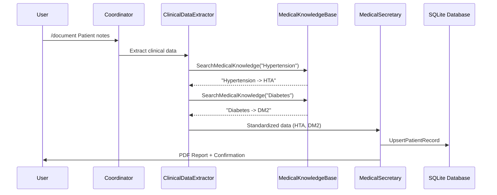

# 08-medical-rag-system

**RAG-Based Medical Terminology Standardization System**

A multi-agent medical documentation system that uses **Retrieval-Augmented Generation (RAG)** to ensure consistent medical terminology. The `ClinicalDataExtractor` agent consults a local knowledge base before outputting medical acronyms, preventing hallucinations and ensuring standardization.

## 🎯 Key Features

- **RAG-Based Standardization**: Mandatory knowledge base lookup for all medical conditions
- **Local Knowledge Base**: Simple text file (`acronyms.txt`) with medical term mappings
- **Automatic Seeding**: Creates default medical acronyms on first run
- **Multi-Agent Workflow**: Coordinator → ClinicalDataExtractor (RAG) → MedicalSecretary
- **Persistent Storage**: SQLite database + PDF report generation

## 🏗️ Architecture

```
┌─────────────────┐
│  Coordinator    │  Routes requests to specialists
└────────┬────────┘
         │
    ┌────┴─────────────────────────┐
    │                              │
┌───▼──────────────┐      ┌────────▼──────────┐
│ ClinicalData     │      │ MedicalSecretary  │
│ Extractor        │──────▶│                   │
│                  │      │ - Database        │
│ Tools:           │      │ - PDF Export      │
│ • SearchMedical  │      └───────────────────┘
│   Knowledge      │
└──────┬───────────┘
       │
   ┌───▼────────────────┐
   │ MedicalKnowledge   │
   │ Base (RAG)         │
   │                    │
   │ acronyms.txt       │
   └────────────────────┘
```

## 🚀 Quick Start

### Prerequisites

- .NET 10.0 SDK
- LM Studio running locally on `http://localhost:1234`
- Model: `qwen2.5-7b-instruct` (or update `modelId` in Program.cs)

### Run the System

```bash
cd 08-medical-rag-system
dotnet run
```

On first run, the system will:
1. Create `hospital.db` (SQLite database)
2. Create `MedicalDocuments/acronyms.txt` with default medical term mappings
3. Start the multi-agent system

## 📖 Usage

### Commands

```bash
/document <notes>    # Process clinical notes with RAG standardization
/query <patient>     # Query patient information
/list                # List all patients in database
/reset               # Clear conversation history
/help                # Show available commands
/exit                # Save and exit
```

### Example: Document a Patient

```bash
> /document Patient John Doe, 65 years old, Room 305. Medical history: Hypertension, Diabetes Mellitus Type 2. Admitted for Chronic Obstructive Pulmonary Disease exacerbation.
```

**What Happens**:
1. **Coordinator** routes to `ClinicalDataExtractor`
2. **ClinicalDataExtractor** calls `SearchMedicalKnowledge` for each condition:
   - "Hypertension" → finds "HTA"
   - "Diabetes Mellitus Type 2" → finds "DM2"
   - "Chronic Obstructive Pulmonary Disease" → finds "COPD"
3. **ClinicalDataExtractor** outputs standardized data:
   ```
   Patient: John Doe
   Room: 305
   Age: 65
   Medical History (AP): HTA, DM2, COPD
   Current Diagnosis (Dx): Chronic Obstructive Pulmonary Disease exacerbation
   ...
   ```
4. **MedicalSecretary** saves to database and generates PDF

## 🧠 RAG Knowledge Base

### Location

`MedicalDocuments/acronyms.txt` (auto-created in bin directory)

### Format

```
Hypertension -> HTA
Diabetes Mellitus Type 2 -> DM2
Chronic Obstructive Pulmonary Disease -> COPD
...
```

### Default Acronyms

The system includes 20+ common medical acronyms:
- **HTA**: Hypertension
- **DM2**: Diabetes Mellitus Type 2
- **COPD**: Chronic Obstructive Pulmonary Disease
- **ICC**: Congestive Heart Failure
- **DL**: Dyslipidemia
- **FA**: Atrial Fibrillation
- **CAD**: Coronary Artery Disease
- **CKD**: Chronic Kidney Disease
- **CVA**: Stroke
- **MI**: Myocardial Infarction

### Customization

Edit `acronyms.txt` to add your own medical term mappings. The system uses case-insensitive keyword matching.

## 🔧 Technical Details

### RAG Implementation

**File**: `Infrastructure/MedicalKnowledgeBase.cs`

**Features**:
- **Streaming Search**: Uses `File.ReadLines()` for memory efficiency
- **Case-Insensitive**: Matches terms regardless of case
- **Top-N Results**: Returns up to 5 matching lines
- **Error Handling**: Graceful handling of missing files and IO exceptions

**Method**:
```csharp
[Description("Searches the local knowledge base for standardized medical acronyms...")]
public string SearchMedicalKnowledge(string query)
```

### Agent Instructions

**ClinicalDataExtractor** has a mandatory RAG protocol:

> For every condition in 'Medical History (AP)', you MUST call 'SearchMedicalKnowledge'.
> - Replace full names with acronyms found in the local knowledge base
> - If the tool returns "No specific acronym found", use the full clinical description
> - Do NOT hallucinate acronyms

## 📊 Database Schema

**Table**: `Patients`

| Column | Type | Description |
|--------|------|-------------|
| FullName | TEXT | Primary key |
| Room | TEXT | Room number/identifier |
| Age | INTEGER | Patient age |
| MedicalHistory | TEXT | JSON array of acronyms |
| CurrentDiagnosis | TEXT | Full-text diagnosis (NO acronyms) |
| Evolution | INTEGER | 1=Good, 2=Stable, 3=Bad |
| Plan | TEXT | JSON array of treatment items |
| Observations | TEXT | Additional clinical notes |

## 🎨 Design Principles

### SOLID
- **Single Responsibility**: `MedicalKnowledgeBase` only handles RAG search
- **Dependency Inversion**: Agents depend on tool abstractions

### KISS
- Simple keyword-based search (no vector embeddings)
- Streaming file reading (memory-efficient)

## 🔄 Differences from 07-shared-state-memory

| Feature | 07-shared-state-memory | 08-medical-rag-system |
|---------|------------------------|------------------------|
| Acronym Source | Agent's internal knowledge | Local knowledge base (RAG) |
| Standardization | Manual/inconsistent | Enforced via tool |
| Hallucination Risk | High | Low (tool-verified) |
| Knowledge Base | None | `acronyms.txt` |
| ClinicalDataExtractor Tools | None | `SearchMedicalKnowledge` |

## 📝 Example Workflow



## 🧪 Testing

See [walkthrough.md](file:///C:/Users/ismae/.gemini/antigravity/brain/9da88761-9be0-4f86-9d6d-5a126eb01546/walkthrough.md) for detailed testing instructions.

**Quick Test**:
```bash
dotnet run
> /document Patient Test, 50 years old. History: Hypertension. Admitted for chest pain.
```

Expected: Medical History shows "HTA" (from RAG lookup), not "Hypertension".

## 📚 Related Projects

- **07-shared-state-memory**: Base template (without RAG)
- **06-multi-agent-with-memory**: Multi-agent with conversation history
- **05-multi-agent-system-advance**: Advanced multi-agent patterns

## 🛠️ Future Enhancements

- [ ] Vector database integration for semantic search
- [ ] Multi-language support (Spanish medical terms)
- [ ] Synonym handling (e.g., "high blood pressure" → "hypertension")
- [ ] Knowledge base versioning and updates
- [ ] Admin UI for managing acronyms

## 📄 License

Part of the `aprendizaje-agent-framework` learning project.
