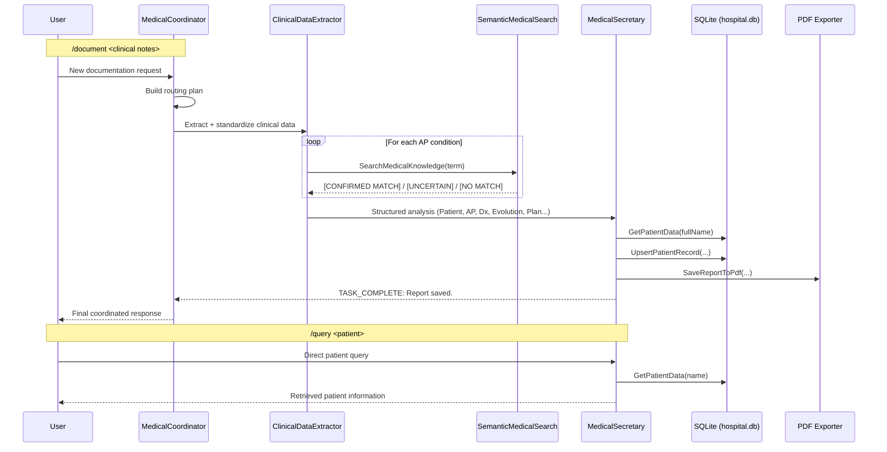
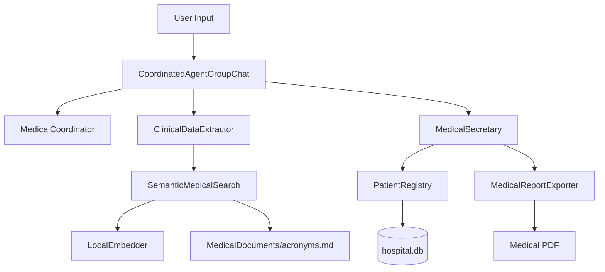

# 09-medical-semantic-rag

Semantic-RAG multi-agent medical system with coordinator routing, local embeddings, vector similarity search, SQLite persistence, and PDF report generation.

## Overview

Project 09 upgrades project 08 from keyword lookup to **semantic retrieval**:

- Uses `SmartComponents.LocalEmbeddings` to generate vectors locally.
- Builds an in-memory semantic index from `MedicalDocuments/acronyms.md`.
- Applies confidence thresholds to control acronym usage:
  - `>= 0.85` → `[CONFIRMED MATCH]` (safe acronym)
  - `0.60 - 0.84` → `[UNCERTAIN]` (keep original term)
  - `< 0.60` → `[NO MATCH]` (keep original term)

## Agent Communication



## Runtime Architecture



## Prerequisites

- .NET 10 SDK
- LM Studio running at `http://localhost:1234/v1`
- Chat model loaded in LM Studio (default: `qwen2.5-7b-instruct`)
- Local embedding model available for `LocalEmbedder` (loaded in-process by the app)

## Run

```bash
cd agents-examples/09-medical-semantic-rag
dotnet run
```

Startup sequence:

1. Load local embedder
2. Build vector index from `MedicalDocuments/acronyms.md`
3. Initialize SQLite (`hospital.db`)
4. Create coordinator + specialist agents
5. Load chat history from `chat_history_coordinator.json` if present

## Commands

```text
/query <patient>     Fast patient lookup (direct secretary route)
/document <notes>    Full workflow (Coordinator -> Extractor -> Secretary)
/list                List all patients
/reset               Clear in-memory conversation history
/help                Show command help
/exit                Save history and exit
```

Free-form text input is also supported; the coordinator auto-routes the workflow.

## Semantic Knowledge Base

Path: `MedicalDocuments/acronyms.md`

Line format:

```text
Main Term | Acronym | Synonym1, Synonym2, ...
```

Examples:

```text
Hypertension | HTA | Arterial Hypertension, High Blood Pressure
Diabetes Mellitus Type 2 | DM2 | Diabetes, Type 2 Diabetes, sugar disease
Chronic Obstructive Pulmonary Disease | COPD | Emphysema, Chronic Bronchitis
```

## Key Files

- `Program.cs` — app startup, command loop, agent wiring
- `CoordinatedAgentGroupChat.cs` — coordinator plan/route/synthesis orchestration
- `Infrastructure/SemanticMedicalSearch.cs` — vector index + cosine similarity tool
- `AgentInstructions.cs` — strict extractor/secretary protocols
- `PatientRegistry.cs` — persistence tools
- `MedicalReportExporter.cs` — PDF tool

## What Changed vs Project 08

- Replaces keyword RAG with local embedding-based semantic retrieval
- Adds confidence-gated acronym policy (`CONFIRMED`, `UNCERTAIN`, `NO MATCH`)
- Uses a richer knowledge file with synonyms to improve recall
- Preserves the same coordinator + specialist workflow pattern
